# ERD Skema Awal

Dokumen ini hanya menggambarkan deklarasi dalam [`supabase/migrations/001_initial_schema.sql`](../supabase/migrations/001_initial_schema.sql): **20 tabel `public`** dan satu referensi eksternal ke `auth.users`. Nama tabel, kolom, nullability, FK, serta perilaku penghapusan di bawah mengikuti SQL tersebut. `uuid`, `date`, dan `timestamptz` direpresentasikan sebagai string ISO pada kontrak TypeScript.

> Catatan transaksi: berkas SQL dimulai dengan `begin` dan berakhir dengan `rollback`. Karena itu, jika berkas dijalankan persis apa adanya, perubahan dalam transaksi tersebut dibatalkan.

## Diagram relasi

Notasi Mermaid: `||` tepat satu, `o|` nol atau satu, dan `o{` nol atau banyak. `AUTH_USERS` adalah tabel eksternal dan tidak termasuk dalam hitungan 20 tabel `public`.

```mermaid
erDiagram
    AUTH_USERS ||--o| profiles : "id CASCADE"
    profiles o|--o| teachers : "profile_id SET NULL"
    profiles o|--o{ grade_submissions : "aktor SET NULL"
    profiles o|--o{ audit_logs : "user_id SET NULL"

    academic_years ||--o{ semesters : "academic_year_id CASCADE"
    academic_years ||--o{ student_classes : "academic_year_id CASCADE"
    academic_years ||--o{ teacher_subjects : "academic_year_id CASCADE"

    teachers o|--o{ classes : "homeroom_teacher_id SET NULL"
    teachers ||--o{ teacher_subjects : "teacher_id CASCADE"
    students ||--o{ student_classes : "student_id CASCADE"
    classes ||--o{ student_classes : "class_id CASCADE"
    subjects ||--o{ teacher_subjects : "subject_id CASCADE"
    classes ||--o{ teacher_subjects : "class_id CASCADE"

    students ||--o{ grades : "student_id CASCADE"
    teacher_subjects ||--o{ grades : "teacher_subject_id CASCADE"
    assessment_types ||--o{ grades : "assessment_type_id RESTRICT"
    semesters ||--o{ grades : "semester_id CASCADE"
    teacher_subjects ||--o{ grade_submissions : "teacher_subject_id CASCADE"
    semesters ||--o{ grade_submissions : "semester_id CASCADE"

    students ||--o{ report_cards : "student_id CASCADE"
    classes ||--o{ report_cards : "class_id CASCADE"
    semesters ||--o{ report_cards : "semester_id CASCADE"
    students ||--o{ attendance : "student_id CASCADE"
    semesters ||--o{ attendance : "semester_id CASCADE"

    students ||--o{ student_extracurriculars : "student_id CASCADE"
    extracurriculars ||--o{ student_extracurriculars : "extracurricular_id CASCADE"
    semesters ||--o{ student_extracurriculars : "semester_id CASCADE"
    students ||--o{ achievements : "student_id CASCADE"
    semesters ||--o{ achievements : "semester_id CASCADE"
    students ||--o{ behavior_records : "student_id CASCADE"
    semesters ||--o{ behavior_records : "semester_id CASCADE"

    AUTH_USERS {
        uuid id PK
    }
    school_settings {
        uuid id PK
        text school_name
        text school_npsn "nullable"
        text school_address "nullable"
        text school_phone "nullable"
        text school_email "nullable"
        text school_website "nullable"
        text principal_name "nullable"
        text principal_nip "nullable"
        text logo_url "nullable"
        boolean ranking_enabled
        timestamptz created_at
        timestamptz updated_at
    }
    academic_years {
        uuid id PK
        text name UK
        date start_date "nullable"
        date end_date "nullable"
        boolean is_active
        timestamptz created_at
        timestamptz updated_at
    }
    semesters {
        uuid id PK
        uuid academic_year_id FK
        semester_type name
        boolean is_active
        timestamptz created_at
    }
    profiles {
        uuid id PK,FK
        text full_name
        app_role role
        text avatar_url "nullable"
        boolean is_active
        timestamptz created_at
        timestamptz updated_at
    }
    teachers {
        uuid id PK
        uuid profile_id FK,UK "nullable"
        text nip UK "nullable"
        text nuptk "nullable"
        text full_name
        text email "nullable"
        text phone "nullable"
        boolean is_active
        timestamptz created_at
        timestamptz updated_at
    }
    students {
        uuid id PK
        text nis UK "nullable"
        text nisn UK "nullable"
        text full_name
        gender_type gender "nullable"
        text birth_place "nullable"
        date birth_date "nullable"
        text nik "nullable"
        text address "nullable"
        text father_name "nullable"
        text mother_name "nullable"
        text phone "nullable"
        boolean is_active
        timestamptz created_at
        timestamptz updated_at
    }
    classes {
        uuid id PK
        text name
        integer grade_level
        uuid homeroom_teacher_id FK "nullable"
        timestamptz created_at
        timestamptz updated_at
    }
    student_classes {
        uuid id PK
        uuid student_id FK
        uuid class_id FK
        uuid academic_year_id FK
        timestamptz created_at
    }
    subjects {
        uuid id PK
        text code UK "nullable"
        text name
        text group_name "nullable"
        numeric minimum_score "nullable"
        boolean is_active
        timestamptz created_at
        timestamptz updated_at
    }
    teacher_subjects {
        uuid id PK
        uuid teacher_id FK
        uuid subject_id FK
        uuid class_id FK
        uuid academic_year_id FK
        timestamptz created_at
    }
    assessment_types {
        uuid id PK
        text name
        text code UK
        numeric weight
        boolean is_active
        timestamptz created_at
    }
    grades {
        uuid id PK
        uuid student_id FK
        uuid teacher_subject_id FK
        uuid assessment_type_id FK
        uuid semester_id FK
        numeric score "nullable"
        text notes "nullable"
        grade_status status
        timestamptz submitted_at "nullable"
        timestamptz verified_at "nullable"
        timestamptz locked_at "nullable"
        timestamptz created_at
        timestamptz updated_at
    }
    grade_submissions {
        uuid id PK
        uuid teacher_subject_id FK
        uuid semester_id FK
        grade_status status
        uuid submitted_by FK "nullable"
        timestamptz submitted_at "nullable"
        uuid verified_by FK "nullable"
        timestamptz verified_at "nullable"
        uuid locked_by FK "nullable"
        timestamptz locked_at "nullable"
        timestamptz created_at
        timestamptz updated_at
    }
    report_cards {
        uuid id PK
        uuid student_id FK
        uuid class_id FK
        uuid semester_id FK
        numeric total_score "nullable"
        numeric average_score "nullable"
        integer ranking "nullable"
        text homeroom_note "nullable"
        text status
        timestamptz generated_at "nullable"
        timestamptz created_at
        timestamptz updated_at
    }
    attendance {
        uuid id PK
        uuid student_id FK
        uuid semester_id FK
        integer sick
        integer permission
        integer absent
        text notes "nullable"
        timestamptz created_at
        timestamptz updated_at
    }
    extracurriculars {
        uuid id PK
        text name
        text description "nullable"
        boolean is_active
        timestamptz created_at
    }
    student_extracurriculars {
        uuid id PK
        uuid student_id FK
        uuid extracurricular_id FK
        uuid semester_id FK
        numeric score "nullable"
        text description "nullable"
        timestamptz created_at
    }
    achievements {
        uuid id PK
        uuid student_id FK
        uuid semester_id FK
        text title
        text level "nullable"
        text description "nullable"
        timestamptz created_at
    }
    behavior_records {
        uuid id PK
        uuid student_id FK
        uuid semester_id FK
        text category "nullable"
        text description "nullable"
        numeric score "nullable"
        timestamptz created_at
    }
    audit_logs {
        uuid id PK
        uuid user_id FK "nullable"
        text action
        text table_name "nullable"
        uuid record_id "nullable"
        jsonb old_data "nullable"
        jsonb new_data "nullable"
        timestamptz created_at
    }
```

## Semantik dan batas model

- **Riwayat kelas hanya per tahun.** `student_classes` menghubungkan siswa, kelas, dan `academic_year_id`; tidak ada `semester_id`. Constraint `unique(student_id, academic_year_id)` membatasi satu kelas per siswa untuk satu tahun akademik. Tabel `classes` sendiri juga tidak memiliki tahun akademik.
- **Penugasan guru hanya per tahun.** `teacher_subjects` menghubungkan guru, mapel, kelas, dan `academic_year_id`; tidak ada semester pada penugasan. Kombinasi `(teacher_id, subject_id, class_id, academic_year_id)` unik.
- **Nilai dan submission memiliki semester langsung.** `grades.semester_id` dan `grade_submissions.semester_id` adalah FK langsung ke `semesters`. Keduanya juga menunjuk `teacher_subjects`, tetapi initial SQL tidak memiliki constraint yang membuktikan bahwa tahun semester sama dengan `teacher_subjects.academic_year_id`.
- **Kehadiran adalah agregat semester.** Satu baris `attendance` menyimpan jumlah `sick`, `permission`, dan `absent` untuk seorang siswa dalam satu semester, bukan kejadian kehadiran harian. Kombinasi `(student_id, semester_id)` unik dan ketiga hitungan harus nonnegatif.
- **Rapor menyimpan hasil komputasi.** `report_cards` menyediakan penyimpanan `total_score`, `average_score`, dan `ranking`, ditambah catatan/status/waktu generasi. Initial SQL tidak mendefinisikan fungsi atau trigger yang menghitung nilai-nilai itu; kolom tersebut nullable. Satu siswa hanya dapat memiliki satu rapor per semester melalui `unique(student_id, semester_id)`.
- `grades.score` dibatasi ke 0–100 bila tidak null. `classes.grade_level` dibatasi 1–12. `report_cards.status` adalah `text`, bukan enum `grade_status`.
- `assessment_types` adalah master global; ia tidak terkait langsung dengan mapel, kelas, tahun, atau semester. Kode jenis penilaian unik secara global.
- Trigger `updated_at` hanya dipasang pada `school_settings`, `profiles`, `teachers`, `students`, `classes`, `subjects`, `grades`, `report_cards`, dan `attendance`. Walaupun `academic_years` dan `grade_submissions` memiliki kolom `updated_at`, initial SQL tidak memasang trigger pembaruan untuk keduanya.

## Perilaku penghapusan FK

- **CASCADE:** `auth.users → profiles`; `academic_years → semesters/student_classes/teacher_subjects`; `teachers → teacher_subjects`; `students → student_classes/grades/report_cards/attendance/student_extracurriculars/achievements/behavior_records`; `classes → student_classes/teacher_subjects/report_cards`; `subjects → teacher_subjects`; `teacher_subjects → grades/grade_submissions`; `semesters → grades/grade_submissions/report_cards/attendance/student_extracurriculars/achievements/behavior_records`; dan `extracurriculars → student_extracurriculars`.
- **SET NULL:** penghapusan profil mengosongkan `teachers.profile_id`, ketiga kolom aktor pada `grade_submissions`, dan `audit_logs.user_id`; penghapusan guru mengosongkan `classes.homeroom_teacher_id`.
- **RESTRICT:** `grades.assessment_type_id` mencegah penghapusan jenis penilaian yang masih direferensikan nilai.

Cascade dapat merambat. Contohnya, menghapus tahun menghapus semester; penghapusan semester kemudian menghapus data semester seperti nilai, submission, rapor, kehadiran, kegiatan siswa, prestasi, dan perilaku. Menghapus kelas juga menghapus penugasan kelas, lalu nilai/submission yang bergantung pada penugasan tersebut.

## Ringkasan RLS

RLS diaktifkan pada seluruh 20 tabel, tetapi policy yang dideklarasikan tidak memberi akses umum pada seluruh tabel:

- Admin memperoleh policy `FOR ALL` pada `school_settings`, `academic_years`, `semesters`, `teachers`, `students`, `classes`, `student_classes`, `subjects`, `teacher_subjects`, `assessment_types`, `grades`, `grade_submissions`, dan `report_cards`.
- Semua pengguna `authenticated` dapat membaca `academic_years`, `semesters`, `subjects`, dan `assessment_types`.
- Pengguna hanya dapat membaca dan memperbarui baris `profiles` miliknya sendiri, tetapi trigger menolak perubahan mandiri pada `role` dan `is_active`. Admin mempunyai policy pengelolaan profil.
- Guru atau wali dapat membaca `teacher_subjects` miliknya. Policy baca nilai memakai kepemilikan penugasan; insert/update nilai dibatasi khusus role `teacher`, penugasan sendiri, dan status `draft`.
- Guru dapat membaca siswa pada kelas penugasannya. Wali dapat membaca kelas binaan, siswa dan `student_classes` kelas binaan, serta nilai siswa kelas binaan.
- Admin dapat membaca `audit_logs` melalui policy select.
- Admin memiliki policy penuh pada `attendance`, `extracurriculars`, `student_extracurriculars`, `achievements`, dan `behavior_records`. SQL awal belum memberi policy pengelolaan tabel-tabel tersebut kepada wali kelas. Tidak ada policy pengguna biasa pada `school_settings`, `teachers`, `grade_submissions`, atau `report_cards` selain policy admin.

Fungsi `current_user_role()` mengambil role profil untuk `auth.uid()`, sedangkan `current_teacher_id()` mengambil guru pertama dengan `profile_id = auth.uid()`. SQL mengaktifkan RLS tetapi tidak menggunakan `FORCE ROW LEVEL SECURITY`; owner/service role yang dapat melewati RLS tidak setara dengan sesi pengguna `authenticated` biasa.

## Status verifikasi

Migration dan seed dieksekusi oleh test PGlite. Harness menyediakan stub objek Supabase Auth dan melewati instalasi `pgcrypto` karena extension control file tidak tersedia di PGlite. Pengujian pada Supabase staging tetap diperlukan sebelum produksi.
